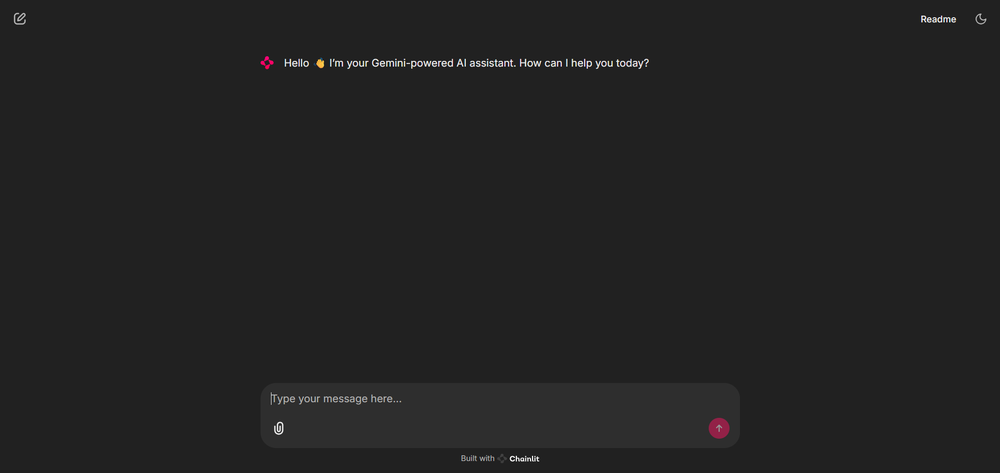

# Gemini Chatbot with Chainlit  

An **AI-powered chatbot** built using [Chainlit](https://docs.chainlit.io/), the **Google Gemini API**, and the **OpenAI Agents SDK**.  
This project demonstrates conversational intelligence with a clean, interactive UI.  

---

## ✨ Features
- 🔹 Powered by **Google Gemini API** (`gemini-2.0-flash`)  
- 🔹 Built with the **OpenAI Agents SDK** for modular AI agent management  
- 🔹 **Chainlit UI** for smooth, real-time chat experience  
- 🔹 Supports conversation memory  
- 🔹 Easy `.env`-based API key management  

---

## ⚙️ Setup & Installation

### 1. Clone the repo
```bash
git clone https://github.com/your-username/gemini-chainlit-chatbot.git

cd gemini-chainlit-chatbot
```
### 2. Create a virtual environment
```bash
python -m venv venv
source venv/bin/activate   # Mac/Linux
venv\Scripts\activate      # Windows
```

### 3. Install dependencies
```bash
pip install -r requirements.txt
```

### 4. Add your Gemini API key
 You can see an .env in you project root so just add an gemini-api-key there
```bash
GEMINI_API_KEY=your_gemini_api_key_here
```
### 5. Run the chatbot
```bash
chainlit run main.py -w
```
Then open the URL shown in your terminal to start chatting 🎉